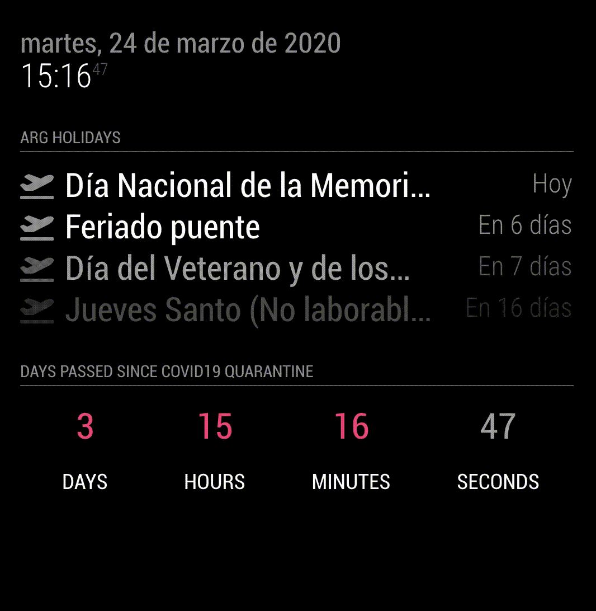

# MMM-CountUP
A [MagicMirror²](https://magicmirror.builders) helper module to create a progressive counter from a specific date.

[](https://raw.githubusercontent.com/bibaldo/MMM-CountUP/master/LICENSE)



## Installation

In your terminal, go to your MagicMirror's Module folder:
````
cd ~/MagicMirror/modules
````

Clone this repository:
````
git clone https://github.com/bibaldo/MMM-CountUP.git
````

Add the module to the modules array in the `config/config.js` file:
````javascript
  {
    module: 'MMM-CountUP'
  },
````

## Configuration options

The following properties can be configured:


| Option                       | Description
| ---------------------------- | -----------
| `header`                     | The header text <br><br> **Default value:** `'Days passed since COVID19 Quarantine'`
| `date`                       | Start date <br> **Format:** `YYYY-MM-DD`
| `time`                       | Start time <br> **Format:** `HH:MM:SS`

## Config Example

````javascript
  {
    module: 'MMM-COVID19',
    config: {
      header: 'Days passed since COVID19 Quarantine',
      date: '2020-03-21',
      time: '00:00:00'
    }
  },
````
## Updating

To update the module to the latest version, use your terminal to go to your MMM-CountUP module folder and type the following command:

````
git pull
```` 

I've inspired in doing this module because of the COVID-19 Quarantine but you can use it for whatever you want

Feel free to open any Issue :smiley:
